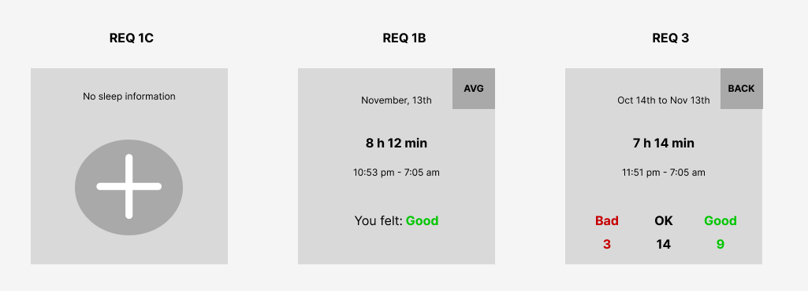

# Backend Engineering Interview: Take-home Assignment

Hello!

This is the repository that contains everything you need to complete the take home assignment, part of the backend interview process for Noom.

## The Assignment

You need to develop an API for sleep logger that will later be integrated into the Noom web interface. The functional requirements API needs to support are:

- Create the sleep log for the last night
  - Sleep data contains
    - The date of the sleep (today)
    - The time in bed interval
    - Total time in bed
    - How the user felt in the morning: one of [BAD, OK, GOOD]
- Fetch information about the last night's sleep
- Get the last 30-day averages
  - Data that needs to be included in the response
    - The range for which averages are shown
    - Average total time in bed
    - The average time the user gets to bed and gets out of bed
    - Frequencies of how the user felt in the morning
  - The user can switch back to the single sleep log view (goes to requirement #1)

The assignment is to:

- Create tables required to support the functionality above (PostgreSQL)
  - The Spring project includes Flyway, which you should use to manage your DB migrations.
- Build required functionality in the REST API service (Kotlin/Java + Spring)
  - Ignore authentication and authorization, but make the REST API aware of the concept of a user.
- Write unit tests for the repository and any business logic.
- Write a simple script or create Postman collection that can be used to test the API

## Instructions

- Create a git repository from the files provided here.
- All code changes should be merged in as PRs to the repository. Separate your commits into meaningful pieces, and don't commit artifacts like build files etc.
- Write code and PR descriptions as if you were writing production-level code.
- The template in this repository provides a basic environment. Everything needed to start and test your code is available and functional. We expect you to use PostgreSQL and Java/Kotlin + Spring. On top of that, if you want to add new frameworks, you are free to do so.
- Keep in mind the goal of the interview is to assess your software development and coding skills. There's no need to spend time tweaking the configuration of the server, the DB, or the build system. The defaults in use here are good enough for this exercise.
- Once complete, zip the repository and upload it to the take-home link provided to you by Noom's talent team.

## How to Run

Dockerfiles are set up for your convenience for running the whole project. You will need docker and ports 5432 (Postgres) and 8080 (API).

To run everything, simply execute `docker-compose up`. To build and run, execute `docker-compose up --build`.

## Wireframes

